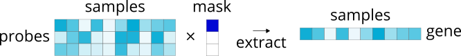
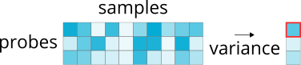
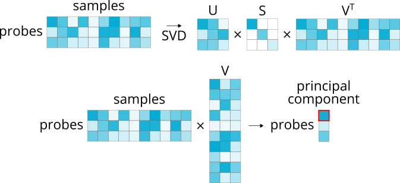
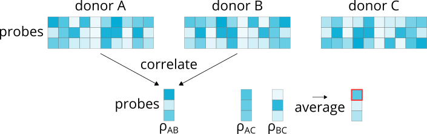
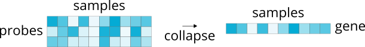
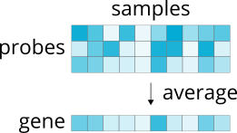

.. _usage_probe_selection:

Probe selection options
=======================

The probes used to measure microarray expression levels in the AHBA data are
often redundant; that is, there are frequently several probes indexing the same
gene. Since the output of the :func:`abagen.get_expression_data` workflow is a
region by gene dataframe, at some point we need to transition from indexing
probe expression level to indexing gene expression levels. Effectively, this
means we need to select from or condense the redundant probes for each gene;
however, there are a number of ways to do that.

Currently, ``abagen`` supports seven options for this probe to gene conversion.
All the options have been used at various points throughout the published
record, so while there is no "right" choice we do encourage using the default
option (:ref:`differential stability <usage_probes_diff_stability>`) due to
recent work by Arnatkevičiūte et al., 2019 showing that it provides the highest
fidelity to RNA sequencing data.

Available methods for ``probe_selection`` fall into two primary families:

    1. :ref:`usage_probes_select`, and
    2. :ref:`usage_probes_collapse`

We describe all the methods within these families here. Methods can be
implemented by passing the ``probe_selection`` argument to the
:func:`abagen.get_expression_data` function. For a selection of references to
published works that have used these different methods please see the
documentation of :func:`abagen.probes.collapse_probes`.

.. _usage_probes_select:

Selecting a representative probe
--------------------------------

The first group of methods aim to **select** a single probe from each redundant
group. This involves generating some sort of selection criteria and masking the
original probe by sample expression matrix to extract only the chosen probe,
which will be used to represent the associated gene's microarray expression
values:

The only difference between methods in this group is the criteria used to
select which probe to retain. The descriptions below explain how the mask in
the above diagram is generated for each available option; in each diagram the
red outline on the generated vector indicates which entry will be used to mask
the original matrix. The extraction procedure (i.e., applying the mask to the
original probe by sample expression matrix) is identical for all these methods.

.. _usage_probes_max_intensity:

Max intensity
^^^^^^^^^^^^^

.. code-block:: python

    >>> abagen.get_expression_data(atlas['image'], probe_selection='max_intensity')

Selects the probe with the highest average expression across all samples (where
samples are concatenated across donors).

.. _usage_probes_max_variance:

Max variance
^^^^^^^^^^^^

.. code-block:: python

    >>> abagen.get_expression_data(atlas['image'], probe_selection='max_variance')

Selects the probe with the highest variance in expression across all samples
(where samples are concatenated across donors).

.. _usage_probes_pc_loading:

Principal component loading
^^^^^^^^^^^^^^^^^^^^^^^^^^^

.. code-block:: python

    >>> abagen.get_expression_data(atlas['image'], probe_selection='pc_loading')

Selects the probe with the highest loading on the first principal component
derived from the probe microarray expression across all samples (where samples
are concatenated across donors).

.. _usage_probes_correlation:

Correlation
^^^^^^^^^^^

.. code-block:: python

    >>> abagen.get_expression_data(atlas['image'], probe_selection='corr_intensity')
    >>> abagen.get_expression_data(atlas['image'], probe_selection='corr_variance')

When there are more than two probes indexing the same gene, selects the probe
with the highest average correlation to other probes across all samples (where
samples are concatenated across donors).

When there are exactly two probes the correlation procedure cannot be used, and
so you can fall back to either the :ref:`usage_probes_max_intensity`
(``corr_intensity``) or the :ref:`usage_probes_max_variance`
(``corr_variance``) criteria.

.. _usage_probes_diff_stability:

Differential stability
^^^^^^^^^^^^^^^^^^^^^^

.. code-block:: python

    >>> abagen.get_expression_data(atlas['image'], probe_selection='diff_stability')

Computes the Spearman correlation of microarray expression values for each
probe across brain regions for every **pair** of donors. Correlations are
averaged and the probe with the highest correlation is retained.

.. _usage_probes_collapse:

Collapsing across probes
------------------------

In contrast to selecting a single representative probe for each gene and
discarding the others, we can instead opt to use all available probes and
**collapse** them into a unified representation of the associated gene:

Currently only one method supports this operation:

.. _usage_probes_average:

Average
^^^^^^^

.. code-block:: python

    >>> abagen.get_expression_data(atlas['image'], probe_selection='average')

Takes the average expression values for all probes indexing the same gene.

Providing ``'mean'`` instead of ``'average'`` will return identical results.
